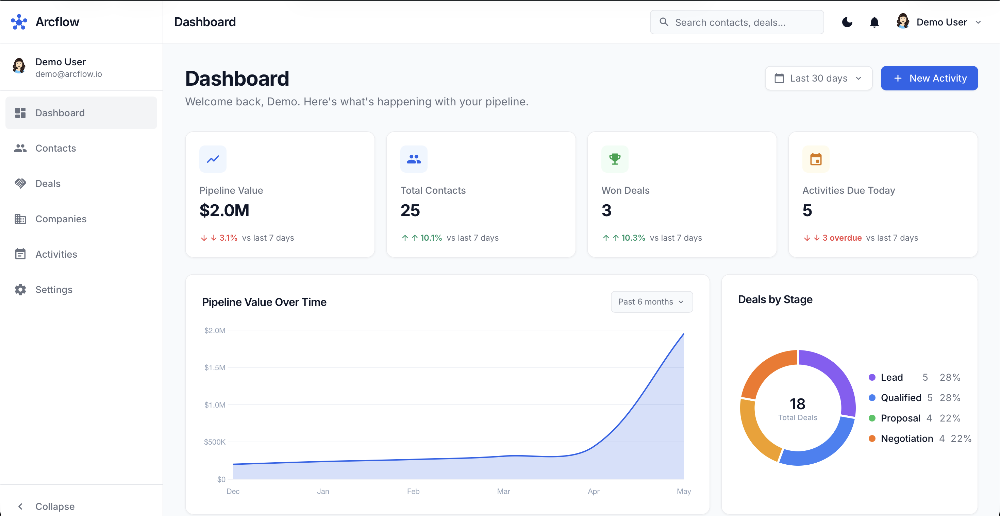

# Arcflow

A production-grade Enterprise CRM built with **Angular 21**, **NgRx**, **Tailwind CSS**, and **Angular Material**.



## Features

- **Dashboard** — KPI widgets, pipeline line chart, deals-by-stage donut, scrollable recent activity & top deals (5 rows visible)
- Contacts management (CRUD, search, filter, table & card views)
- Deals pipeline (Kanban drag-and-drop + list view)
- Companies management
- Activity feed & logging (including quick “New Activity” from the dashboard)
- Dark / light mode with system preference
- NgRx state management
- Lazy-loaded feature modules
- Fully responsive (mobile + tablet)

## Tech stack


- **UI:** Tailwind utility classes + shadcn-style primitives in `shared/ui` (buttons, cards, inputs, badges, etc.), with Material for dialogs, snackbars, and legacy pieces
- **Charts:** Chart.js via `ng2-charts`

## Getting started

```bash
git clone https://github.com/akshaybhende/Arcflow.git
cd Arcflow
npm install
npm start
```

Open http://localhost:4200 and sign in with:

- **Email:** `demo@arcflow.io` (any `*@arcflow.io` address works)
- **Password:** `demo123`

### Production build

```bash
npm run build
```

### Tests

```bash
npm test
```

## Data & API

The app is wired like a real backend but runs **without a server** in development:

| Layer | What it does |
|--------|----------------|
| **Services** | `HttpClient` calls REST-style endpoints (`/api/contacts`, `/api/deals`, etc.) |
| **In-memory API** | `angular-in-memory-web-api` intercepts requests and serves seed data from `src/app/mock/mock-data.ts` |
| **NgRx** | Effects load data into the store; feature screens read from selectors |

**Dashboard demo metrics** (KPI values, trend labels, and pipeline-over-time chart) use **seeded random** data in `store/dashboard/dashboard-kpi.selectors.ts` so the UI looks lively while staying stable during a session. Recent activity, top deals, and the deals-by-stage chart still use live mock store data.

Auth is also mocked: credentials are checked in `AuthService` against `MOCK_USERS` (no auth API).

To connect a real API later, remove or disable `HttpClientInMemoryWebApiModule` and point services at your backend; replace dashboard KPI selectors with API-driven metrics when ready.

## Architecture

```
src/app/
├── core/          # Auth, HTTP services, guards, interceptors, models
├── shared/        # Reusable components, pipes, directives, ui/ primitives
├── layout/        # Main shell (sidebar, topbar)
├── store/         # NgRx slices (contacts, deals, companies, activities, ui, dashboard KPIs)
├── features/      # Lazy-loaded modules (dashboard, contacts, deals, …)
└── mock/          # In-memory API + seed data
```

**State:** Each entity uses `@ngrx/entity` with effects calling `HttpClient` against the in-memory web API. UI state covers theme, sidebar collapse, and global loading.

**Routing:** Authenticated routes sit under `MainLayout` with `AuthGuard`. Feature modules load on demand.

**Styling:** Global tokens in `src/styles/_tokens.scss` and Tailwind theme variables in `src/styles/styles.scss` (light gray app background, white cards, blue primary).

See [arcflow-prd.md](./arcflow-prd.md) for the full product specification.

## License

MIT
